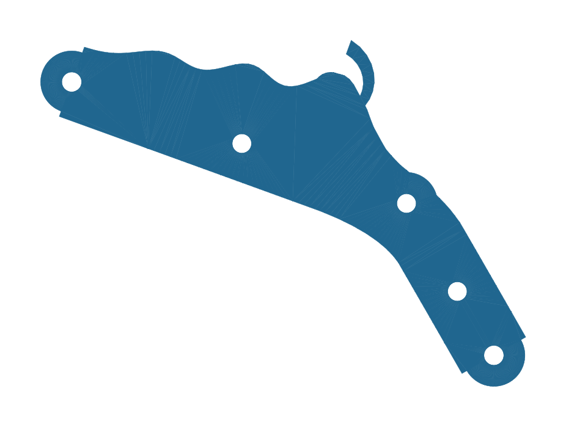

# Caliber K1 — an open-source, 3D-printable, complication-ready watch movement

**Nobody has published a working, printable, conventional watch movement designed
as a platform for complications. This project builds one — in public.**

The movement itself is the road, not the destination. The destination is two
complications that don't exist yet in mechanical horology:

1. **A haptic metronome** — taps your wrist at an adjustable musical tempo,
   powered by its own dedicated mainspring barrel (the architecture of
   mechanical alarm watches like the Vulcain Cricket, pointed at a new job).
2. **A world-class tide indication** — going beyond every existing tide watch
   (Corum, IWC, CVDK all model a single tidal constituent) by mechanically
   summing a second constituent — the "priming and lagging" of the tides —
   plus perigean spring tides via an anomalistic-month cam.

Everything is **parametric Python ([build123d](https://github.com/gumyr/build123d))**:
the CAD is code, every dimension traces to [`caliber_k1/parameters.py`](caliber_k1/parameters.py),
every design decision is a reviewable git diff, and geometry is unit-tested
before any printer wastes plastic.

## Status

**Rev B in progress** — after a design review of the assembled rev A, the
movement is being rearchitected from a storey stack into classic two-plate
watch construction (see [log 0009](docs/log/0009-rev-b-architecture.md)).
Rev A remains fully documented below as the proving ground for every
library rev B is built from.

| Milestone | What | Status |
|---|---|---|
| 1 | **Going barrel** — printed mainspring, drum, arbor, ratchet & click, test stand | 🟢 frame printed & verified; spring/click await PETG |
| 2 | **Going train** — cycloidal wheels, whirlpool spokes, the wave bridge | 🟡 designed, print pending |
| 3 | **Escapement + balance** — pin-pallet lever, printed hairspring, the jewel in the wave | 🟡 designed, print pending |
| 4 | Motion works, hands, dial + published complication-module interface | ⚪ |
| 5 | First complication module: moon phase (Oechslin-style epicyclic) | ⚪ |
| 6 | The haptic metronome | ⚪ |
| 7 | The tide complication | ⚪ |

Scale: this is a desk-scale movement (Ø150 mm plate) — watch architecture at a
size FDM printing genuinely masters. Proven precedent: [Christoph Laimer's
printed tourbillon](https://www.thingiverse.com/thing:1249221) (Ø102 mm, runs).

The ocean — the tide complication's destination — lives in the frame itself:
the train bridge is a breaking wave, and the wheels spin on whirlpool spokes.



## Build it

```bash
python3 -m venv .venv && .venv/bin/pip install -r requirements.txt
.venv/bin/python -m pytest tests/          # geometry sanity checks
.venv/bin/python -m caliber_k1.export      # writes STEP/STL/SVG to out/
.venv/bin/python tools/render_previews.py  # PNG previews of every part
```

Slice the STLs (or the STEPs directly) in Bambu Studio / your slicer of choice.
Print settings and the metal-parts shopping list are in
[docs/milestones/01-going-barrel.md](docs/milestones/01-going-barrel.md).

## Repository layout

- `caliber_k1/parameters.py` — every dimension in the caliber, one file
- `caliber_k1/barrel.py` — Milestone 1 parts (drum, spring, arbor, ratchet, click…)
- `caliber_k1/stand.py` — test-stand fixture
- `caliber_k1/export.py` — regenerates all output files
- `tests/` — geometry checks that run in CI before anything gets printed
- `docs/milestones/` — build guides, print settings, BOMs
- `docs/log/` — the engineering log (decisions and why)

## Licensing

- **Hardware designs** (everything under `caliber_k1/`, plus generated geometry):
  [CERN-OHL-S v2](LICENSE) — strongly reciprocal open hardware license.
- **Tooling** (`tools/`, CI): [MIT](LICENSE-MIT).

## Follow along

Build-in-public links (site, TikTok, videos) land here as they go live.
