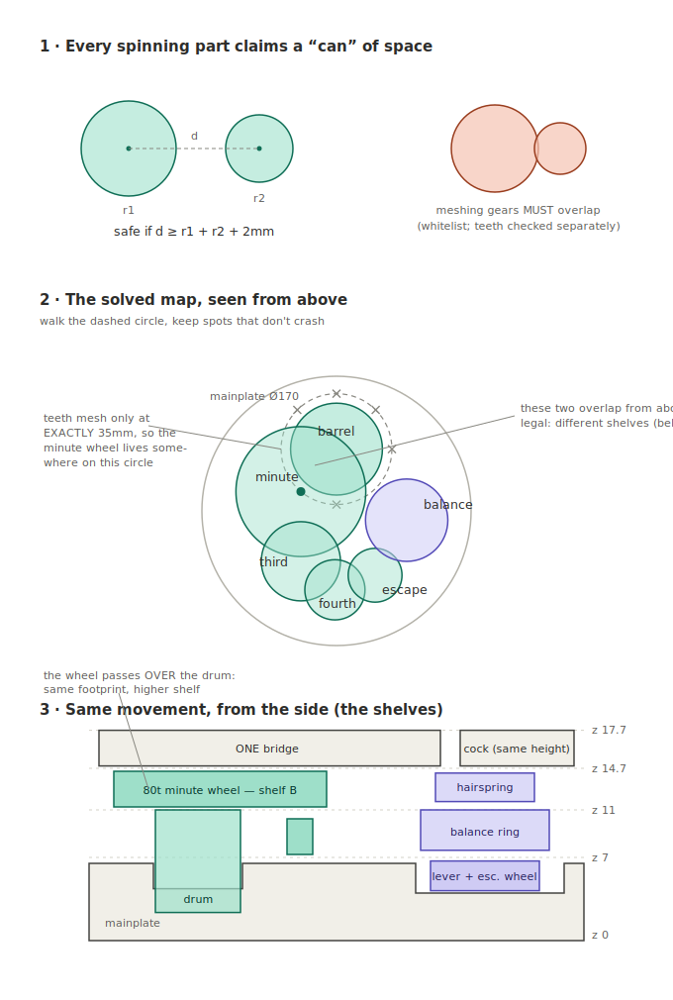

# How the rev C layout solver works

*(Plain-English companion to `caliber_k1/revc.py` — the code is ~80 lines;
this is the idea behind them.)*

## The trick that makes it all possible: forget the tooth shapes

A gear is a complicated shape, but the moment it *spins*, it occupies a
simple cylinder — a can. So the solver never looks at teeth at all. Each
part becomes five numbers: where it sits (x, y), how fat it is (radius),
and which heights it spans (bottom z, top z). That's a `Sweep` — the whole
movement is about twenty cans.

The payoff is that "do these two parts ever touch, at any rotation, at any
moment?" collapses to grade-school math: **if two cans share any height,
the distance between their centers must beat the sum of their radii plus
2mm of air.** Distance between centers is the Pythagorean theorem. One
subtraction, one square root — millions of checks per second, where asking
the CAD kernel to intersect two toothed solids takes about a second each.

## Two escape hatches make it a watch instead of a parking lot

1. **Gears that are *supposed* to touch** (meshing pairs) are on a
   whitelist — the can test skips them, and their tooth-by-tooth
   engagement is proven later by the slow, accurate CAD probes
   (`tests/test_revc_parts.py`), run once instead of millions of times.
2. **Cans only conflict if they share height** — the shelf system. The 80t
   minute wheel flies right over the barrel because it's on shelf B and
   the drum tops out below it. Watchmakers have exploited this for three
   centuries; the solver gets it as a rule.

## The search is a compass walk

Meshing gears must sit at an *exact* center distance — the minute wheel
belongs precisely 35mm from the barrel. So its position isn't free; it's
somewhere on a circle. The solver puts the barrel down, swings a compass
around it, and tries 36 spots (every 10°). Each survivor gets a new
compass swung around *it* for the next wheel, and so on down the chain:
barrel → minute → third → fourth → escape → balance. Six nested compasses.

## Pruning is why it finishes before we retire

Naively that's 36⁵ ≈ sixty million layouts. But the moment a candidate
spot crashes into anything already placed, the solver abandons it **and
every layout that would have been built on top of it** — millions of dead
branches lopped off with one failed subtraction. It's how you solve a
maze: you don't map the whole dead end, you turn around at the wall.
Survivors get scored, and the winner is the layout whose farthest part
edge stays closest to center — the most compact watch that breaks no rules.

## The one weakness — and it bit us twice

The solver only knows what the cans tell it. The pallet fork isn't
remotely can-shaped (it's a rocking arm), so we approximate it with two
circles covering its full swing. When those circles were drawn too small,
the solver cheerfully approved layouts where the *real* fork poked into
the *real* plate. Both "unsolvable!" panics and one genuine collision in
this project traced to dishonest cans — never to bad math.

That's why the pipeline is belt-and-suspenders:

| stage | speed | what it proves |
|---|---|---|
| can test (`check_all`) | millions/sec | placement never collides, at any rotation |
| tooth probes (phase-aligned) | ~1 sec each | meshing gears engage without jamming |
| assembled-pose gates | ~30 sec total | the exported STEP itself is clean |

The cans buy speed; the probes keep them honest.
