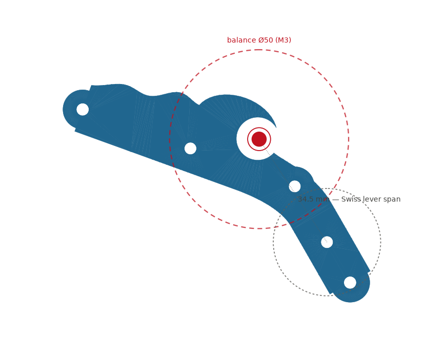

# 0003 — The jewel lives in the barrel of the wave

Jon asked whether the balance jewel would sit in the middle of the breaking
wave on the train bridge. It hadn't been planned — but the geometry already
agreed: the wave's tube center sits 34.5 mm from the escape arbor, and a
module-1, 30-tooth escape wheel wants its balance center at 30–36 mm
(2.0–2.4x escape pitch radius). The tube IS a balance seat.

So it's now a design contract, not a coincidence:
- `decor.wave_tube_center()` exposes the seat position.
- `test_wave_tube_is_a_balance_seat` fails any future layout change that
  pulls the tube out of lever-escapement reach.

Milestone 3 implications:
- Balance (Ø~50, 1 Hz) centered on the tube; wheel sweeps over the crest.
- Lower pivot bearing: a small chaton set in the tube, held from beneath
  the bridge so the wave's mouth stays visually open around it. The
  "jewel" itself can be a 4 mm red glass cabochon (or printed red cap) —
  the pearl in the wave.
- Plate grows Ø150 -> ~Ø170 (one parameter) to clear the balance rim.

