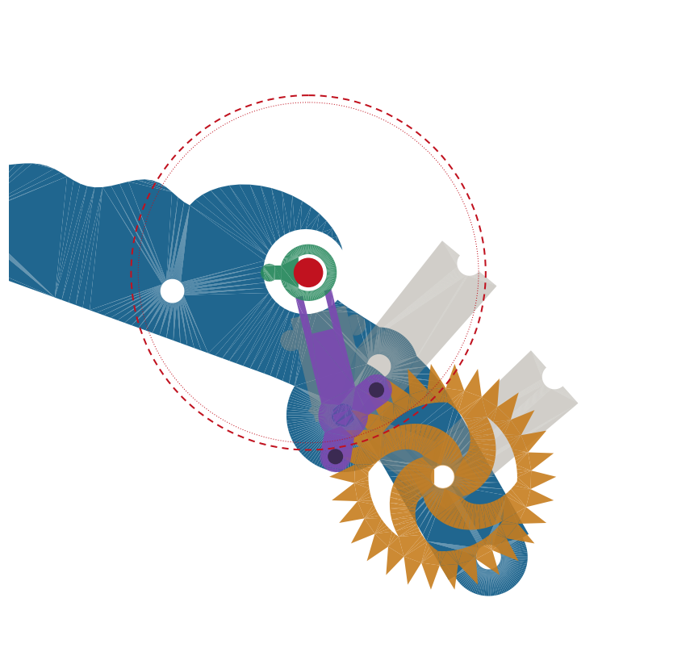

# 0004 — Milestone 3: the escapement storey

Pin-pallet lever escapement above the wave bridge; balance centered on the
wave tube per the 0003 contract. Key numbers: pallet arbor 16.5mm from the
escape arbor (pins subtend 3.5 tooth spaces, engage 1.6mm); fork 20.7mm;
balance Ø50 at 1 Hz; hairspring 11 coils × 0.45mm PLA, predicted T=1.037s.
Physics lives in parameters.py (balance_inertia, hairspring_stiffness,
predicted_period) — CI fails if the oscillator drifts out of the nut-trim
band. Plate grew to Ø170. Platform stands on two plate-rooted pillars after
the clearance test caught bridge-mounted legs inside the escape wheel sweep
(center-distance checks lie; radii matter).

